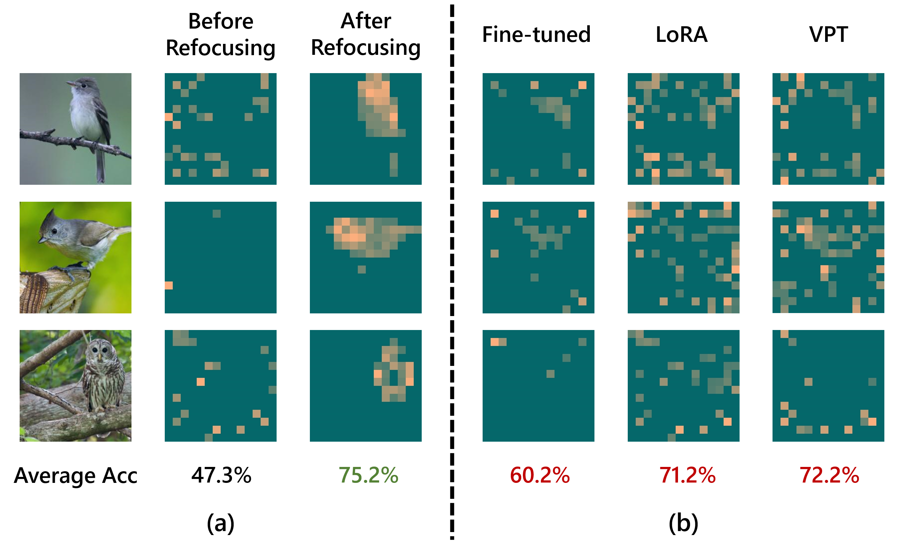
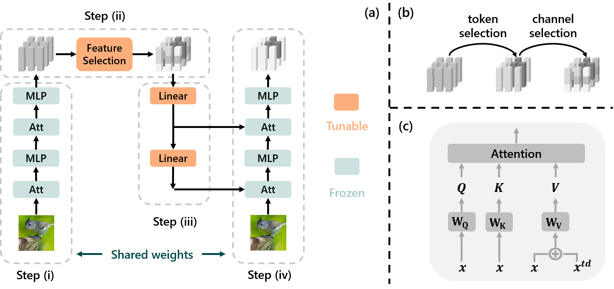

# TOAST: Top-Down Attention Steering


This is the official codebase of TOAST, from the following paper:

[Refocusing Is Key to Transfer Learning]() \
[Baifeng Shi](https://bfshi.github.io), [Siyu Gai](https://github.com/Catherine0505), [Trevor Darrell](https://people.eecs.berkeley.edu/~trevor/), and [Xin Wang](https://xinw.ai/)\
UC Berkeley, Microsoft Research




## Motivation

We find previous transfer learning methods (fine-tuning, LoRA, prompt tuning, etc.) often fail to focus on the features relevant to the downstream tasks (see figure above). We show that refocusing the attention to task-relevant features can improve downstream performances.

## What is TOAST?

TOAST is a transfer learning algorithm which transfers a large pre-trained model to a downstream task by refocusing the model's attention to task-relevant features. Specifically, TOAST freezes the pre-trained backbone and tunes a top-down attention module to refocus the attention (see figure below).



## This repo contains

- `visual_classification`: TOAST for visual classification (including transfer learning on FGVC and VTAB)
- `language_generation`: TOAST for language generation (including transfer learning on Alpaca)

## Links

This codebase is largely built upon 
- "[Top-Down Visual Attention from Analysis by Synthesis](https://github.com/bfshi/AbSViT)" 
- "[Visual Prompt Tuning](https://github.com/KMnP/vpt)"
- "[Stanford Alpaca: An Instruction-following LLaMA Model](https://github.com/tatsu-lab/stanford_alpaca)"

[//]: # ()
[//]: # (## Citation)

[//]: # (If you found this code helpful, please consider citing our work: )

[//]: # ()
[//]: # (```bibtext)

[//]: # (@article{shi2022visual,)

[//]: # (  title={Visual Attention Emerges from Recurrent Sparse Reconstruction},)

[//]: # (  author={Shi, Baifeng and Song, Yale and Joshi, Neel and Darrell, Trevor and Wang, Xin},)

[//]: # (  journal={arXiv preprint arXiv:2204.10962},)

[//]: # (  year={2022})

[//]: # (})

[//]: # (```)