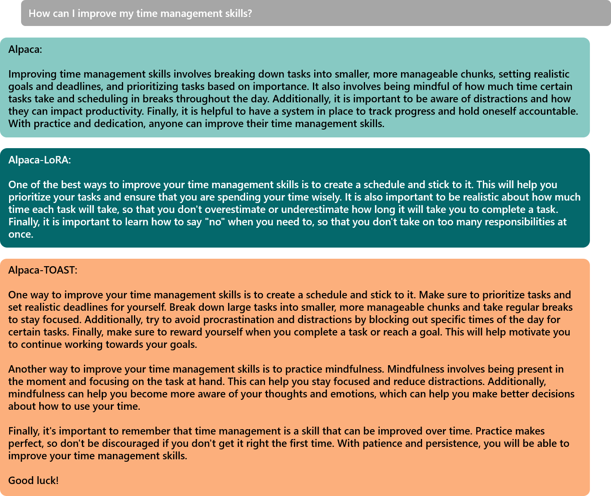

# TOAST for Language Generation



## Environment settings

```bash
pip install -r requirements.txt
```

## Model Zoo

|                    Name                     |                                        Weights                                         |
|:-------------------------------------------:|:--------------------------------------------------------------------------------------:|
| LLaMA-7B-topdown (pre-tuned on OpenWebText) | [weights](https://berkeley.box.com/shared/static/j4ulxk1cr56wih6lpu81x95uti65loqk.bin) |
| LLaMA-7B-topdown (tuned on Alpaca 52k data) | [weights](https://berkeley.box.com/shared/static/th0muks4nlh5flian5rvwapmg4ry1ps3.bin) |


## Running

### Inference

To test LLaMA-7B-topdown on custom instructions, please first download the tuned top-down weights and then run
```
python inference.py --model_name_or_path decapoda-research/llama-7b-hf --bf16 True --fsdp "full_shard auto_wrap" --fsdp_transformer_layer_cls_to_wrap 'LlamaDecoderLayer' --tf32 True --report_to "none" --output_dir <output_path> --model "llama-topdown" --checkpoint <path_to_tuned_topdown_weights>
```

We have some preset questions in `inference.py`. Feel free to change them to your own instructions!

### Tuning on Alpaca 52k Data

To train TOAST on Alpaca 52k data, first download the pretuned top-down weights and then run
```
torchrun --nproc_per_node=4 --master_port=5959 train.py --model_name_or_path decapoda-research/llama-7b-hf --data_path ./alpaca_data.json --bf16 True --output_dir <output_path> --num_train_epochs 3 --per_device_train_batch_size 3 --per_device_eval_batch_size 3 --gradient_accumulation_steps 12 --evaluation_strategy "no" --save_strategy "steps" --save_steps 2000 --save_total_limit 1 --learning_rate 2e-5 --weight_decay 0. --warmup_ratio 0.03 --lr_scheduler_type "cosine" --logging_steps 1 --tf32 True --report_to "none" --deepspeed "./configs/default_offload_opt_param.json" --model "llama-topdown" --checkpoint <path_to_pretuned_weight>
```

To try LoRA or fully-finetuning, please set `--model "llama"` or `--model "llama-lora"` and discard the `--checkpoint` argument.

If you would like to test your tuned model, you need first convert the format of saved model checkpoints. To do this, go to the output path and run
```
python zero_to_fp32.py . tuned_weights.bin
```

This will save your model checkpoint into `tuned_weights.bin`, which is ready to use for inferece.

### Pre-tuning on OpenWebText

To pre-tune the top-down module, run
```
torchrun --nproc_per_node=4 --master_port=4455 pretune_top_down.py --model_name_or_path decapoda-research/llama-7b-hf --data_path ./alpaca_data.json --bf16 True --output_dir <output_path> --num_train_epochs 1 --per_device_train_batch_size 3 --per_device_eval_batch_size 3 --gradient_accumulation_steps 12 --evaluation_strategy "no" --save_strategy "steps" --save_steps 2000 --save_total_limit 1 --learning_rate 3e-5 --weight_decay 0. --warmup_ratio 0.03 --lr_scheduler_type "cosine" --logging_steps 1 --tf32 True --report_to "none" --deepspeed "./configs/default_offload_opt_param.json"
```

You also need to run `zero_to_fp32.py` to convert the saved checkpoint for further tuning.