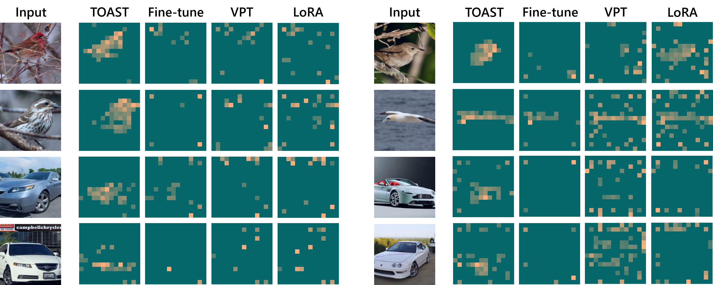

# TOAST for Visual Classification



## Environment settings

See `env_setup.sh`

## Key files

- `src/models/vit/vit_top_down.py` defines a ViT with top-down attention
- `src/models/vit_models.py` defines TOAST, TOAST-Lite, as well as other transfer learning methods (fine-tuning, LoRA, VPT, etc.)

## Data preperation:

- Fine-Grained Visual Classification tasks (FGVC): The datasets can be downloaded following the official links. Data split (json files) can be found here: [Dropbox](https://cornell.box.com/v/vptfgvcsplits), [Google Drive](https://drive.google.com/drive/folders/1mnvxTkYxmOr2W9QjcgS64UBpoJ4UmKaM?usp=sharing). Please simply download the corresponding data split files to the same folder of each dataset.

  - [CUB200 2011](http://www.vision.caltech.edu/visipedia/CUB-200-2011.html)

  - [NABirds](http://info.allaboutbirds.org/nabirds/)

  - [Oxford Flowers](https://www.robots.ox.ac.uk/~vgg/data/flowers/)

  - [Stanford Dogs](http://vision.stanford.edu/aditya86/ImageNetDogs/main.html)

  - [Stanford Cars](https://ai.stanford.edu/~jkrause/cars/car_dataset.html)

- [Visual Task Adaptation Benchmark](https://google-research.github.io/task_adaptation/) (VTAB): see [`VTAB_SETUP.md`](https://github.com/KMnP/vpt/blob/main/VTAB_SETUP.md) for detailed instructions and tips.

## Model Zoo

We provide checkpoints of different pre-trained models. Note that the top-down models are also pre-tuned on ImageNet-1k.

|             Name             |                                       Weights                                        |
|:----------------------------:|:------------------------------------------------------------------------------------:|
|    ViT-B-in1k (bottom-up)    | [model](https://berkeley.box.com/shared/static/zblb4lfqoiyuiyo94a496h45qlqel6r8.pth) |
|    ViT-B-in1k (top-down)     | [model](https://berkeley.box.com/shared/static/ejf7a2vnzg8pmwty0ih4temm2vgw14u5.pth) |
|   ViT-B-in21k (bottom-up)    | [model](https://berkeley.box.com/shared/static/kbsnodpqvowtllze45lkuh90qwxtsxsu.pth) |
|    ViT-B-in21k (top-down)    | [model](https://berkeley.box.com/shared/static/u3w4ie6xww0o2w9kb4rukkkz6lx66ajr.pth) |
|   ViT-L-in21k (bottom-up)    | [model](https://berkeley.box.com/shared/static/ptz6d4nn5jd6gagw0c92b1qi2iaxbx4b.pth) |
|    ViT-L-in21k (top-down)    | [model](https://berkeley.box.com/shared/static/pl1ldyejj14nodumlmj2r3mi7stqy3v9.pth) |
| ConvNeXt-B-in21k (bottom-up) | [model](https://berkeley.box.com/shared/static/g629xskuq56rzo9qxrm8w7yi2rk1l07s.pth) |
| ConvNeXt-B-in21k (top-down)  | [model](https://berkeley.box.com/shared/static/skzkydmvnch8jlpagd4ct6ru9ywyzc9v.pth) |

## Results of ViT-B-in1k on FGVC

|   Method   | CUB  | NABirds | OxfordFlower | Stanford-dogs | Stanford-cars | Average Acc |
|:----------:|:----:|:-------:|:------------:|:-------------:|:-------------:|:-----------:|
|   Linear   | 76.8 |  47.3   |     81.7     |     97.7      |     60.3      |    72.8     |
| Fine-tune  | 80.5 |  60.2   |     86.9     |     94.7      |     83.2      |    81.1     |
|    VPT     | 76.9 |  72.2   |     80.6     |     97.3      |     62.8      |    78.0     |
|    LoRA    | 82.5 |  71.2   |     81.2     |     97.5      |     76.6      |    79.8     |
|   TOAST    | 85.0 |  75.2   |     88.7     |     97.4      |     84.5      |    86.2     |
| TOAST-Lite | 84.5 |  76.9   |     89.4     |     97.4      |     82.0      |    86.0     |

## Running

### Training on FGVC

To train and evaluate TOAST for ViT-Base on FGVC, please run

```
# CUB
python train.py --config-file configs/cub.yaml MODEL.TRANSFER_TYPE "toast" MODEL.MODEL_ROOT <path_to_your_model_weights> DATA.DATAPATH <path_to_your_cub_data> OUTPUT_DIR <output_path> DATA.BATCH_SIZE "32" SOLVER.BASE_LR "0.03" MODEL.TYPE "vit_top_down"

# NABirds
python train.py --config-file configs/nabirds.yaml MODEL.TRANSFER_TYPE "toast" MODEL.MODEL_ROOT <path_to_your_model_weights> DATA.DATAPATH <path_to_your_nabirds_data> OUTPUT_DIR <output_path> DATA.BATCH_SIZE "32" SOLVER.BASE_LR "0.01" MODEL.TYPE "vit_top_down"

# OxfordFlower
python train.py --config-file configs/flowers.yaml MODEL.TRANSFER_TYPE "toast" MODEL.MODEL_ROOT <path_to_your_model_weights> DATA.DATAPATH <path_to_your_flower_data> OUTPUT_DIR <output_path> DATA.BATCH_SIZE "32" SOLVER.BASE_LR "0.01" MODEL.TYPE "vit_top_down"

# Stanford-dogs
python train.py --config-file configs/dogs.yaml MODEL.TRANSFER_TYPE "toast" MODEL.MODEL_ROOT <path_to_your_model_weights> DATA.DATAPATH <path_to_your_dogs_data> OUTPUT_DIR <output_path> DATA.BATCH_SIZE "32" SOLVER.BASE_LR "0.02" MODEL.TYPE "vit_top_down"

# Stanford-cars
python train.py --config-file configs/cars.yaml MODEL.TRANSFER_TYPE "toast" MODEL.MODEL_ROOT <path_to_your_model_weights> DATA.DATAPATH <path_to_your_cars_data> OUTPUT_DIR <output_path> DATA.BATCH_SIZE "32" SOLVER.BASE_LR "0.02" MODEL.TYPE "vit_top_down"
```

Here `MODEL.TRANSFER_TYPE` controls the transfer learning algorith used (choices: `linear`, `end2end`, `prompt`, `lora`, `toast`, `toast-lite`). Note that `linear`, `end2end`, `prompt` and `lora` use `MODEL.TYPE "vit_bottom_up"` and the other two use `MODEL.TYPE "vit_top_down"`.

To train ViT-Large, add the argument `MODEL.SIZE "large"`. To train ConvNeXt, change `MODEL.TYPE` to `convnext_top_down`.

### Training on VTAB

To do grid search and evaluation on VTAB, please run

```
python tune_vtab.py --config-file configs/vtab.yaml --grid-search-type topdown  DATA.DATAPATH <path_to_VTAB_data> DATA.NAME <dataset_name> MODEL.TYPE "vit_top_down" MODEL.TRANSFER_TYPE "toast" MODEL.MODEL_ROOT <path_to_your_model_weights> OUTPUT_DIR <output_path>
```

Arguments are similar to FGVC. Different dataset names are listed in `configs/vtab.yaml`.


## Misc

### Visualizing Attention

You can use `visualize.py` to visualize the attention map of your trained model. An example:
```
python visualize.py --config-file configs/cub.yaml OUTPUT_DIR <output_path> MODEL.MODEL_ROOT <dummy_arg_put_your_untrained_model_weights_here> MODEL.TEST_WEIGHT_PATH <path_to_your_trained_model>
```

### Converting Google ViT weights to DeiT style

`convert_google_vit_large_to_deit.py` converts [google vit-large weights](https://huggingface.co/google/vit-large-patch16-224-in21k) to deit style so that it can be loaded by this repo. If you would like to convert another google vit model, you can use it as a reference.